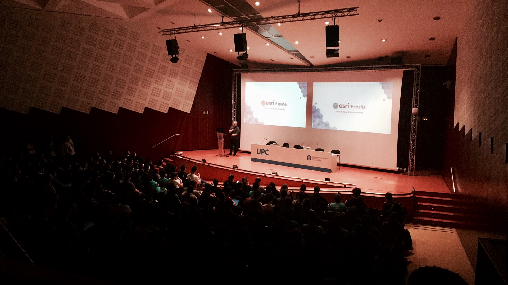
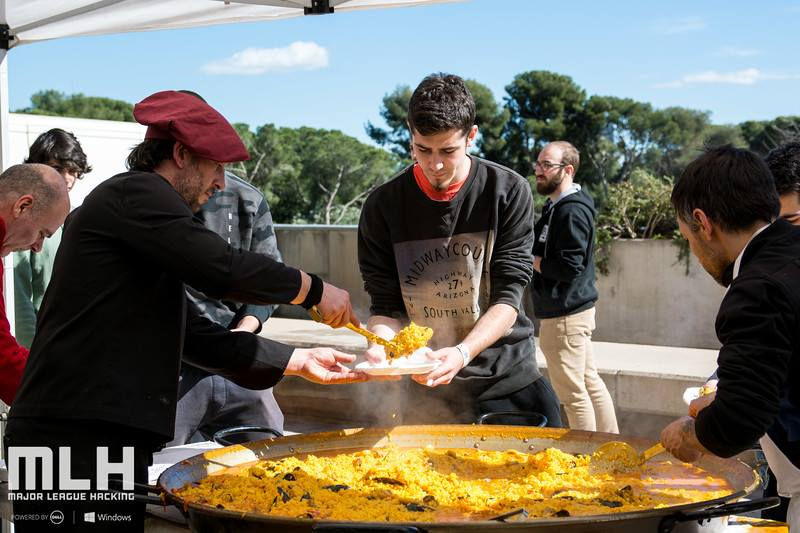
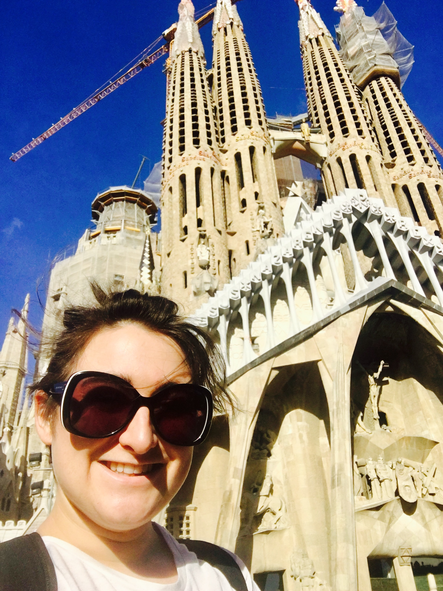
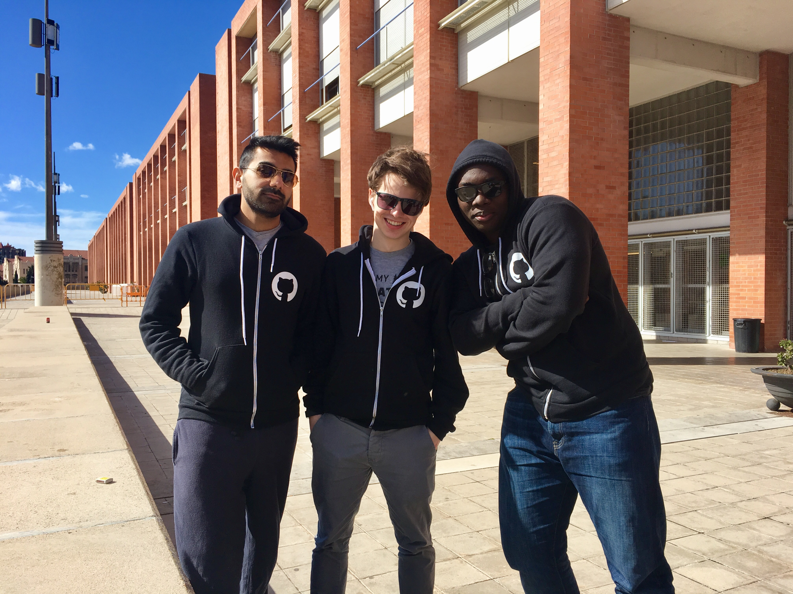

# blogs

## Blogs from events I've been to &lt;3 :octocat:

# HackUPC Blog

Hack UPC is a bi-annual hackathon held at (University name) in the city of Barcelona. This hack attracts a large audience of students from all over Europe and follows the 36 hour format which is not for the feint hearted. 

I attended HackUPC over the 3rd - 5th March 2017 as a GitHub Campus Expert and Hacker - this is a blog post about my experience. 

## Day 1 - Getting to Hack UPC

This was the furthest I've travelled to date to attend a hackathon and boy was I exciteable. There were quite a few UK hackers going to this event, from various universities all across the country, so we'd organised a group chat to co-ordinate plans and the hype was only too real! 

I travelled from London with the lovely @uve in tow, we met at East Croydon to get the Gatwick Express to the airport. We giggled with excitement almost all the way to Barcelona and nothing could burst this bubble (not even my nearly wetting myself as we got on the plane - if anything we just giggled more!)

Now one word of advice, always do a quick check of your directions before you leave your own country - we didn't in fact we didn't even properly check when we got there and this resulted in a slight detour (we ended 15.4km past where we needed to be!) Nevertheless we arrived at HackUPC just as the opening ceremony had begun and it was EPIC. 

Now as a UK hackathon attendee I'm used to going into big lecture halls and seeing around 100-200 people chattering away with smiles as they look forward to starting projects with their friends. HackUPC appeared to have double this - I don't know the exact numbers but I did know this hack attracts around 500 people everytime and boy was that something to experience. Seeing so many people buzzing with the same excitement as myself was just fantastic and I couldn't wait for the weekend to begin. 

We heard from the organisers, sponsors and partners of HackUPC in the introduction to the 36 hours of hacking. There were some great challenges, and the messages from everyone reminded hackers to have fun, rest plenty and find a mentor if they needed help. 

Post ceremony everyone headed to their hacking spaces in the informatics building nearby - there was bustling talk of ideas for hacks in many languages as we proceeded as a group. 

The hacking spaces were well equipped with fridges for keeping drinks cold (namely Redbull as is common with most hackathons) and bottled water was placed at the front of every room - a nice touch. 

Once we were settled in we were invited to get food from the patio area where a spread of sandwiches, salads, noodles and a hot chicken and potato dish had been laid on for us all. There were plenty of options for everyone even gluten-free sandwiches which was nice to experience! 

After dinner, teams started forming and people were starting to dive into the ideation process for their hacks - it was nice to see people being really involved and volunteers came around to engage with the hackers on what they were planning to build. Some of the UK lot hadn't got very far when I left to go to my hotel, a joke of "we'll build something that takes data as an input and then with that data produces an output" was still the best thing on the table. :laughing:

The only downside to this first day was that we had appeared to bring the British weather with us and it rained constantly from just after dinner to the early hours - though it didn't stop us from having a great time! 

## Day 2 - Hacking, More Hacking and Party Parrots

When I returned in the morning, the rain had stopped and the sun was shining, which made for a pleasant walk up to the campus. I took a picture on my way in of the university campus. 

I'd missed the breakfast, but when I approached our building I could smell the paella cooking for our lunch and it smelt good!! 

When I got up to the room where I had been the previous evening the hack was in full swing, with teams huddled together working on their hacks - everyone there was so nice! They even put up (and even joined in) with the Brits errupting in applause every few hours when making jokes or applauding success on a hack. It was entertaining to say the least to share this experience, even with our language barriers everyone was laughing and joining in! 

It had been discovered that the link at the top of the blackboard in our room was actually related to the hack and boy was it beautiful - a page filled with party parrot gifs and music, created for the hackers entertainment and plenty of fun was had seeing who could visit it the most times. See it for yourself [here](http://www.rdsbzlabs.com/) and look at the hilarious number of hits it had! 

I hadn't exactly decided on a hack idea, my workload had been stressful of late due to running a big event myself a few weeks ago (and the paperwork is still on my to do list) , so my plan was to see what I could get done from my todo list and then see what I could learn in my remaining time. However I did build one thing using a GitHub pages site - but this was purely for the other hackers to get involved and win some GitHub stickers from me. 

It was my first hackathon as a GitHub Campus Expert and people loved this Guess Who Game I created - I got loads of engagement from people which was really nice (I love meeting new people!) The game was a webpage where I posted pictures of Octocats from the Octodex but they were just silouettes so you could only see 
the outline. Once I posted them I sent a message to all of the hackers through the HackUPC slack and ask people to guess them and send me a message with their guess, GitHub username and details for a chance to win a GitHub Campus Expert sticker from me. 

People were super quick at guessing and I barely had time to update correct guesses before getting another 4-6 messages with more guesses! 

The last two were guessed in less than a minute and each of the attendees made their way to me with directions to look for my bright red Campus Expert hoody, to come and grab their sticker (meaning they got to stretch their legs and take a much needed screen break - these things are important folks!)

Thanks to everyone who took part in the [game](http://dickensa.github.io/HackUPC_GuessWho) - it was fun to meet you all! 

Following having a great time putting the game together I was spurred on to do something with my time and actually build a hack - go me :laughing:. I figured it was high time I learnt how to build a webpage from scratch instead of relying on templates (that said templates can be super useful for setting up something quickly). 

So I plugged my headphones in and followed some of the w3 schools materials on how to start. 

Side note:  I understand HTML but I'd never done any CSS from scratch or JavaScript and other than picking apart other files I didn't really understand what I needed to do to link all of these together to build my own websites from scratch. 

I would hugely recommend these resources for anyone looking to start out in web development. I was also blessed with having some great helpers around me when I got stuck who could talk about how certain tags worked, the difference between a '.' or '#' prepend to CSS and how to include scripts in the HTML file for my JavaScript elements. 

Hackathons are great for learning, people often say to me "oh I would go to a hackathon but I know nothing" and quite frankly that's actually a perfect situation to be in. You might not feel like you can contribute to a hack but the reality is if you are willing to try and learn as you go then you totally can! 

Within a few hours I had a website that I had built from scratch hosted on GitHub pages with a custom domain thanks to the domain.com credit provided by MLH (Major League Hacking). You can view it [here](http://inclusivewords.com) and the GitHub repository [here](http://github.com/dickensa/inclusivewords.com/).

I submitted my entry for the HackHarassment challenge at just after 3am and decided to go get some sleep before the end of hacking and closing ceremony later in the morning. I took two of the exhausted brits with me to crash on my hotel floor and spare bed - which they were grateful for as they'd missed the opportunity to grab one of the airbeds provided by the organisers (again such a lovely thought from the HackUPC team). 

## Day 3 

In the morning when I returned it was science fair time. . . In all honesty I'm not a big fan of this style of judging but it was well executed and the rooms were a buzz with people talking about their hacks and giving demos. 

This was followed by a lunch of burgers and hotdogs (again the food was on point and they had catered for everyone - include gluten free buns so I was happy!)

The last event of the hack was the closing ceremonies and everyone headed over with their things and smiles on their faces, despite the sleep deprivation. 

There were six presentations put forward for judging and these were some really cool hardware and software hacks. One involved asking Alexa to make dispensing decisions for medication which was really novel; another involved a serious hardware hack of building a directional speaker (I was a huge fan of this hack with my background in audio engineering) which was incredible given the time they built it in! 

Prizes were given, photos were taken and the MLH team encouraged the audience to make a huge amount of noise in saying thanks to the organising team. 

By far my favourite part of this experience was the community, genuinely it was one of the best hacks I have been to for hacker spirit and every member of the HackUPC team made a huge effort to cater to everyones needs and wishes - nothing was too much trouble and they made us feel very at home! 

I hope to revisit for the Fall edition. 

Here's some pictures from my trip! 

 
